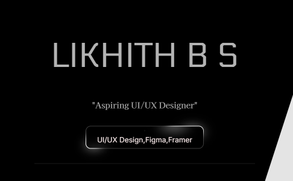
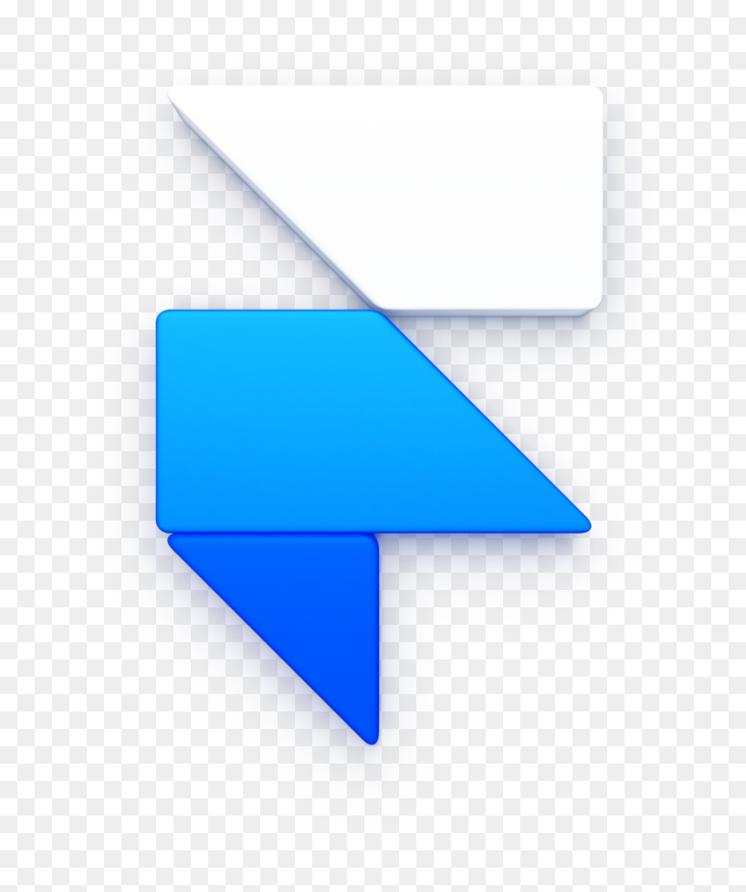

<!-- Banner -->

  

<!-- Intro -->
<h1 align="center">Hi, I'm Likhith BS 👋</h1>

Aspiring UI/UX Designer | Passionate about creating clean, user-friendly designs

---

### 🚀 Tools & Platforms I Use

  
  
  </a>

---

### 📌 About Me
- 🎯 UI/UX Design enthusiast learning **Figma** & **Framer**
- 🎨 Love designing **aesthetic** and **functional** interfaces
- 📚 Constantly improving my design skills

---

### 📬 Connect with Me

  

